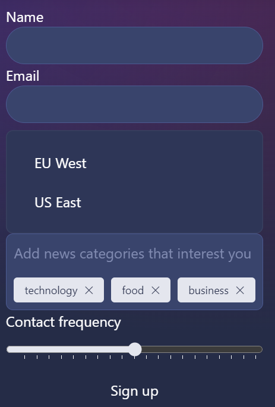

# Forms and Skeleton

As detailed in the last [release changelog](TODO LINK AND VERSION) the [ListBox](https://dev.skeleton.dev/components/listboxes) and [InputChips](https://dev.skeleton.dev/components/input-chips) got reworked pretty heavily to no longer rely on stores. Instead they work with `bind:group={selectedValue}` now, as you can see in the linked documentation. You're still free to bind a store as a value like this `bind:group={$myStore}` though!

The reason for these changes are pretty simple and can be summed up in one sentence: Skeleton tries to rely on native features as much as possible and the changes were necessary to make the components work together with native Form Submission and [SvelteKit's](https://kit.svelte.dev/docs/form-actions#progressive-enhancement) `use:enhance`.  
For a deep dive on how SvelteKit handles Form Submits with Form Actions, we recommend Joy of Codes video on the topic: https://www.youtube.com/watch?v=XNbCp7ZJi-8

## Multiselect values in FormData

There is one thing we want to cover though: How to retrieve multi select data like from InputChips or a multiselect Listbox in a From Action.  
Due to the way FormData is handled during submit there's one thing you'll have to be careful with when retrieving the data on the server:

**Use [FormData.getAll()](https://developer.mozilla.org/en-US/docs/Web/API/FormData/getAll)**

Multi-Selection Data gets submitted to the Server like this:

```js
  { name: 'chips', value: 'paprika' },
  { name: 'chips', value: 'salt & pepper' },
  { name: 'chips', value: 'salt & vinegar' },
```

If you just call FormData.get() in your serverside Action like this:

```ts
export const actions: Actions = {
	default: async (event) => {
		event.request.formData().then((formData) => {
			// Wrong
			let selectedChipFlavours = formData.get('chips');
			// Correct
			selectedChipFlavours = formData.getAll('chips');
		});
	},
};
```

You will only retrieve the first entry in the list and `chipsValue` will only contain `'paprika'`. You need to use `getAll('chips')` to get the full list of values as an array: `['paprika', 'salt & pepper', 'salt & vinegar']`.

## Forms in Skeleton

As already stated, Skeleton tries to work with native inputs as closely as possible, so if you're familiar with HTML forms you can write a beautifully styled HTML form with Skeleton.
All you need to do is attach the correct Skeleton input class to your input elements like so:

```html
<script lang="ts">
	import { enhance } from '$app/forms';
	import { InputChip, ListBox, ListBoxItem, RangeSlider } from '@skeletonlabs/skeleton';

	let region: string = '';
	let interestedInCategories = ['technology', 'food', 'business'];
	let frequency = 50;
</script>

<form method="POST" use:enhance>
	<div class="flex max-w-prose flex-col">
		<label>
			Name
			<input class="input" name="name" type="text" />
		</label>
		<label>
			Email
			<input class="input" name="email" type="email" />
		</label>
		<div class="card mt-2 p-4">
			<ListBox label="Region:">
				<ListBoxItem bind:group="{region}" value="EU West" name="region">EU West</ListBoxItem>
				<ListBoxItem bind:group="{region}" value="US East" name="region">US East</ListBoxItem>
			</ListBox>
		</div>
		<InputChip
			name="interestedInCategories"
			bind:value="{interestedInCategories}"
			placeholder="Add news categories that interest you"
		/>
		<RangeSlider name="frequency" bind:value="{frequency}" max="{100}" step="{5}" ticked
			>Contact frequency</RangeSlider
		>
		<button class="btn-filled-primary btn-base btn mt-3">Sign up</button>
	</div>
</form>
```

The resulting sign up form should look somewhat like this, depending on which Skeleton theme you're using:


Every input, the ListBox, InputChip and RangeSlider values will be automatically submitted when the user presses on the `Sign up` button under the `name`-attribute you provided to the component:

```js
  { name: 'name', value: 'Dominik' },
  { name: 'email', value: 'test@skeleton.dev' },
  { name: 'region', value: 'EU West' },
  { name: 'interestedInCategories', value: 'technology' },
  { name: 'interestedInCategories', value: 'food' },
  { name: 'interestedInCategories', value: 'business' },
  { name: 'frequency', value: '50' }
```

It is therefore **required** to provide a `name`-attribute to these HTML elements and Skeleton Components for Form submission to work correctly.

## Caveats with Form submits

Due to the way ListBoxes and InputChips needed to be implemented to support native Form Submits, they don't reset like the rest of the inputs do.

If your Form redirects to another page you can stop reading here and move on. If you're staying on the same page after submit and would like ListBoxes and InputChips to be reset to their default values on submit as well, keep on reading!

SvelteKit provides you with the option to extend `use:enhance` with a [SubmitFunction](https://kit.svelte.dev/docs/types#public-types-submitfunction) that will be called during form submission.  
All data entered into the Form will already be gathered into a FormData object, so you're free to reset the values of your components to their default values:

```html
<script lang="ts">
	import { enhance, type SubmitFunction } from '$app/forms';
	import { InputChip, ListBox, ListBoxItem, RangeSlider } from '@skeletonlabs/skeleton';

	const defaultRegion = '';
	const defaultNewsCategories = ['technology', 'food', 'business'];

	let region = defaultRegion;
	let interestedInCategories = defaultNewsCategories;
	let frequency = 50;

	const submitWithListBoxSelection: SubmitFunction = () => {
		region = defaultRegion;
		interestedInCategories = defaultNewsCategories;
		return async ({ update }) => {
			update();
		};
	};
</script>

<div class="mt-4 flex justify-center">
	<form method="POST" use:enhance="{submitWithListBoxSelection}">
		<div class="flex max-w-prose flex-col">
			<label>
				Name
				<input class="input" name="name" type="text" />
			</label>
			<label>
				Email
				<input class="input" name="email" type="email" />
			</label>
			<div class="card mt-2 p-4">
				<ListBox label="Region:">
					<ListBoxItem bind:group="{region}" value="EU West" name="region">EU West</ListBoxItem>
					<ListBoxItem bind:group="{region}" value="US East" name="region">US East</ListBoxItem>
				</ListBox>
			</div>
			<InputChip
				name="interestedInCategory"
				bind:value="{interestedInCategories}"
				placeholder="Add news categories that interest you"
			/>
			<RangeSlider name="frequency" bind:value="{frequency}" max="{100}" step="{5}" ticked
				>Contact frequency</RangeSlider
			>
			<button class="btn-filled-primary btn-base btn mt-3">Sign up</button>
		</div>
	</form>
</div>
```
