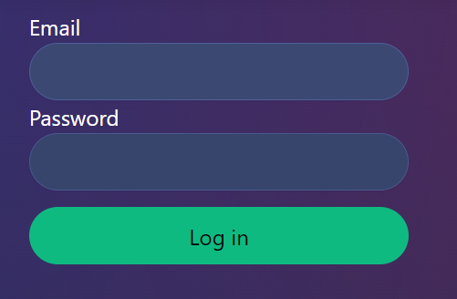
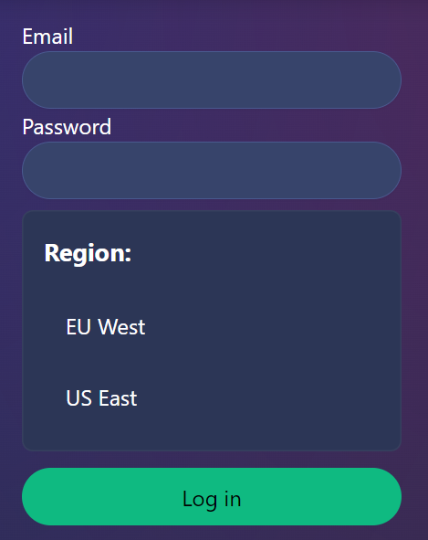

# How to submit a ListBox State as part of a Form

Sometimes native input elements just don't cut it and you want to handle a selection with something like a ListBox from Skeleton.
You'd still like to use the Form submission tools that you're used to from SvelteKit though, because you're used to them and they make Form handling so much easier!   
So you add the Listbox in your existing Form and will find that the selected values won't be included in the FormData you receive on the server side :(

There's an easy way to fix that, though!

## The Basics

Before we dive into how to include ListBoxes as part of your Form submission, let's quickly recap how Forms work in SvelteKit in general.   
You need a Form action listener as part of your ``+page.server.ts`` like [this](https://kit.svelte.dev/docs/form-actions#default-actions) (or with [named actions](https://kit.svelte.dev/docs/form-actions#named-actions)):
```ts
import type { Actions } from "@sveltejs/kit";
 
export const actions: Actions = {
  default: async (event) => {
    console.log(await event.request.formData());
    // Do whatever the form is intended to do
  }
};
```

Then of course you also need the Form itself as part of your ``+page.svelte``:
```html
<form method="POST">
  <label>
    Email
    <input name="email" type="email">
  </label>
  <label>
    Password
    <input name="password" type="password">
  </label>
  <button>Log in</button>
</form>
```

With a bit of Skeleton styling magic, the resulting form should look somewhat like this:


You're all set for handling basic form handling already with that! Now, to add better user experience if JavaScript is available, SvelteKit brings the ``use:enhance`` action.   
Since you already want to have a ListBox as part of your form, your users will need to have JavaScript enabled and we can safely add ``use:enhance`` to your form:
```html
<script lang="ts">
	import { enhance } from '$app/forms';
</script>

<form method="POST" use:enhance>
  <label>
    Email
    <input name="email" type="email">
  </label>
  <label>
    Password
    <input name="password" type="password">
  </label>
  <button>Log in</button>
</form>
```

When submitted, the form will print the submitted FormData to the console:
```
FormData {
  [Symbol(state)]: [
    { name: 'email', value: 'example@skeleton.dev' },
    { name: 'password', value: '1234' },
  ]
}
```

## Adding the ListBox to FormData

Now, we can add the ListBox and make use of ``use:enhance`` to add the ListBox selection state stored in a Svelte store to the submitted FormData.   
First, we add the ListBox and the store containing the selected value, as explained on the [Skeleton Docs](https://www.skeleton.dev/components/listboxes):
```html
<script lang="ts">
	import { enhance} from '$app/forms';
	import { ListBox, ListBoxItem } from '@skeletonlabs/skeleton';
	import { writable, type Writable } from 'svelte/store';

	const storeSingle: Writable<string> = writable('');
</script>

<form method="POST" use:enhance={submitWithListBoxSelection}>
    <div class="max-w-prose flex flex-col">
        <label>
            Email
            <input name="email" type="email">
        </label>
        <label>
            Password
            <input name="password" type="password">
        </label>
        <div class="card p-4 mt-2">
            <ListBox selected="{storeSingle}" label="Region:">
                <ListBoxItem value={"EU West"}>EU West</ListBoxItem>
                <ListBoxItem value={"US East"}>US East</ListBoxItem>
            </ListBox>
        </div>
        <button class="btn btn-filled-primary btn-base mt-3">Log in</button>
    </div>
</form>
```


With a bit of styling, the resulting form looks like this:



If you would submit the form in it's current state, it would still only log the ``email`` and ``password`` provided by the user.   
To add the ListBox state to the submitted FormData, we're going to make use of a [Submit function](https://kit.svelte.dev/docs/types#public-types-submitfunction):
```html
<script lang="ts">
	import { enhance, type SubmitFunction } from '$app/forms';
	import { ListBox, ListBoxItem } from '@skeletonlabs/skeleton';
	import { writable, type Writable } from 'svelte/store';

	const storeSingle: Writable<string> = writable('');

    // Custom submit funtion to include ListBox Data in submitted FormData
	const submitWithListBoxSelection: SubmitFunction = ({ data}) => {
        // We only care about the FormData paramenter of the SubmitFunction Input to append the store data to it
		data.append("selectedRegion", $storeSingle)
	
		return async ({ update }) => {
          // the update function tells SvelteKit to just continue with usual Form submission
          // as if the Submit function weren't there since we made all the changes we wanted to make
		  update();
		};
	  }
</script>

<div class="flex justify-center mt-4">
	<form method="POST" use:enhance={submitWithListBoxSelection}>
			<div class="max-w-prose flex flex-col">
			<label>
			  Email
			  <input name="email" type="email">
			</label>
			<label>
			  Password
			  <input name="password" type="password">
			</label>
			<div class="card p-4 mt-2">
				<ListBox selected="{storeSingle}" label="Region:">
					<ListBoxItem value={"EU West"}>EU West</ListBoxItem>
					<ListBoxItem value={"US East"}>US East</ListBoxItem>
				</ListBox>
			</div>
			<button class="btn btn-filled-primary btn-base mt-3">Log in</button>
		</div>
	</form>
</div>
```

Now the submitted data is going to look like this:
```
FormData {
  [Symbol(state)]: [
    { name: 'email', value: 'example@skeleton.dev' },
    { name: 'password', value: '1234' },
    { name: 'selectedRegion', value: 'EU West' }
  ]
}
```
And that's how you add a ListBox selection (or any other state that's tied to a store instead of an input value) to submitted FormData!
